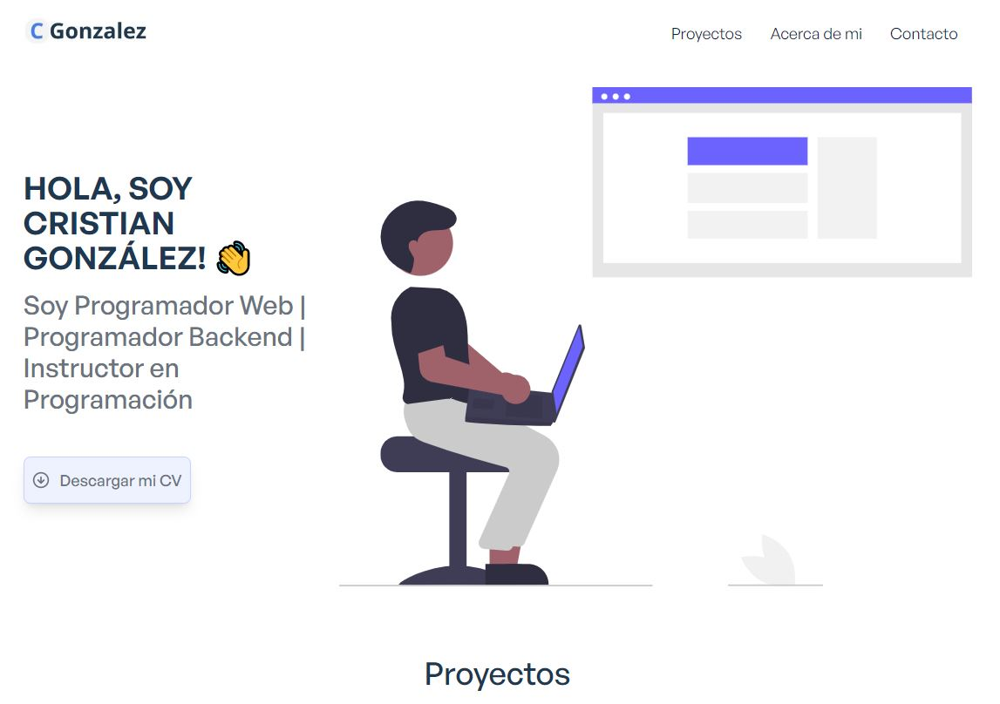

### Descripción

Este mi Portfolio desarrollado con React. 

### [live preview](https://cgonzalez26.github.io)

### Características

- Full Responsive
- Diseño en Múltiples Pages.
- Formulario de Contacto con EmailJs

### Instalación

Obtener código fuente

<pre>git clone https://github.com/cgonzalez26/cgonzalez26-portfolio.git</pre>
 
Instalar dependencias requeridas

<pre>yarn install</pre>

Iniciar el server

<pre>yarn start</pre>